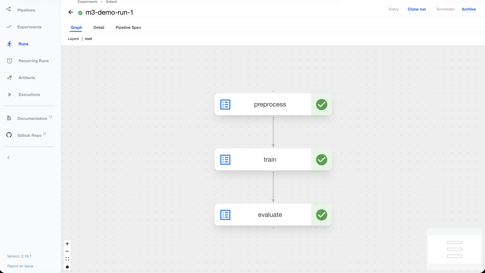
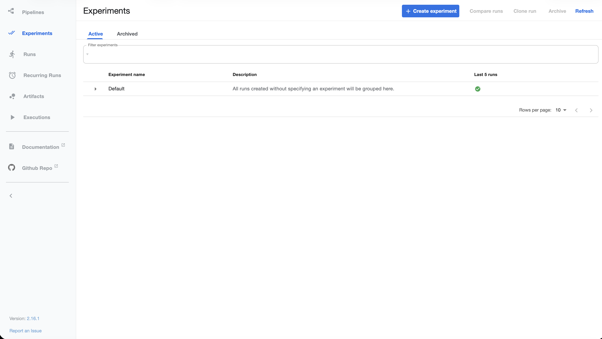
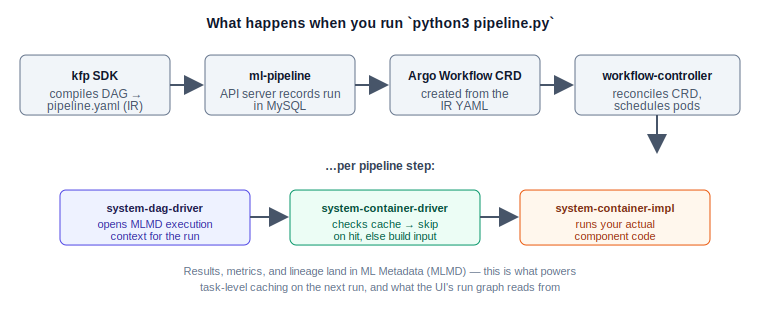

# kubeflow-pipelines-m3-demo

Standalone Kubeflow Pipelines (KFP) deployment on a local `kind` cluster, built and tested on Apple Silicon (M3). Deploys KFP 2.16.1 via Kustomize, with an Argo-Workflows backend, cert-manager-issued TLS for the cache server, and a sample 3-step pipeline (preprocess → train → evaluate).

Includes the same overlay pattern wrapped as an ArgoCD `Application` for teams running GitOps (ArgoCD + Gitea/GitHub) instead of `kubectl apply -k .` by hand.

📄 **For the full architecture write-up — Kubeflow's subprojects, KFP internals, pros/cons, a competitor comparison (MLflow, SageMaker, Vertex AI, Flyte, etc.), and the original design rationale for this demo — see [`docs/kubeflow-technical-overview.md`](docs/kubeflow-technical-overview.md).** This README is the operational quickstart; that doc is the narrative explanation of *why*.

## Repo layout

```
.
├── kind/
│   └── kind-cluster.yaml          # local kind cluster config
├── argocd/
│   └── bootstrap.sh               # installs ArgoCD into the kind cluster
├── platform-tools/
│   └── kubeflow-pipeline/
│       └── kustomization.yaml     # KFP Kustomize overlay (NodePort UI, SeaweedFS fsGroup fix, cache-deployer removed)
├── pipelines/
│   ├── requirements.txt
│   ├── pipeline.py                # KFP SDK pipeline definition + run trigger
│   └── components/
│       ├── preprocess.py
│       ├── train.py
│       └── evaluate.py
├── gitops/
│   └── argocd-application.yaml    # ArgoCD Application wrapping the same overlay
├── scripts/
│   ├── cluster-stop.sh            # stop kind containers to free CPU/RAM
│   └── cluster-resume.sh          # bring the stopped cluster back up
└── docs/
    ├── kubeflow-technical-overview.md
    └── images/
        ├── kfp-run-graph.png       # real screenshot: run graph (preprocess → train → evaluate)
        ├── kfp-experiments-list.png # real screenshot: experiments list
        └── run-execution-flow.svg   # diagram: internal driver/impl pod execution (not screenshot-able)
```

## Prerequisites

- Docker Desktop or Colima (6 vCPU / 10 GB RAM minimum allocated)
- `kind`, `kubectl`, `kustomize` (`brew install kind kubectl kustomize`)
- Python 3.11+

## Quickstart

```bash
# 1. Create the kind cluster
kind create cluster --name kubeflow-demo --config kind/kind-cluster.yaml

# 2. Install cert-manager
kubectl apply -f https://github.com/cert-manager/cert-manager/releases/download/v1.20.0/cert-manager.yaml
kubectl wait --for=condition=available --timeout=120s -n cert-manager deployment --all

# 3. Install KFP cluster-scoped resources
kubectl apply -k "github.com/kubeflow/pipelines/manifests/kustomize/cluster-scoped-resources?ref=2.16.1"

# 4. Deploy KFP
kubectl apply -k platform-tools/kubeflow-pipeline
kubectl get pods -n kubeflow -w

# 5. Access the UI
kubectl port-forward -n kubeflow svc/ml-pipeline-ui 8090:80
# http://localhost:8090/#/pipelines

# 6. Trigger the sample pipeline
python3 -m venv .venv && source .venv/bin/activate
pip install -r pipelines/requirements.txt
python3 pipelines/pipeline.py
```

## What the demo pipeline actually shows

`pipelines/pipeline.py` defines and submits a deliberately trivial 3-step pipeline — the point isn't the ML, it's seeing the real KFP execution mechanics (Section 4 of `docs/kubeflow-technical-overview.md`) happen on your own cluster instead of reading about them.

| Step | What it does | Default input → output |
|---|---|---|
| `preprocess` | Simulates dropping invalid rows from a raw dataset | `raw_rows=2000` → `clean_rows=1950` |
| `train` | Simulates training, returns a fake accuracy that scales with row count | `clean_rows=1950` → `accuracy≈0.895` |
| `evaluate` | Gates the result against a minimum accuracy threshold | `accuracy≈0.895`, `threshold=0.85` → `PASS` |

Each step is a separate `@dsl.component`-decorated Python function with its own container image (`python:3.11-slim`). You never hand-write the DAG — Kubeflow infers the dependency chain `preprocess → train → evaluate` purely from the fact that `train(clean_rows=pre.output)` consumes `preprocess`'s return value, and `evaluate(accuracy=tr.output)` consumes `train`'s.

### Run graph (KFP UI → Runs → m3-demo-run-1)



Three nodes, top to bottom, each with a green checkmark once it completes. Click any node in the real UI to see its logs, inputs/outputs, and which pod it ran in.

### Experiments list (KFP UI → Experiments)



`pipeline.py` doesn't set an explicit experiment name, so the run lands under the **Default** experiment (KFP auto-creates this and groups any run that doesn't specify one). If you want runs organized separately, pass `experiment_name=` to `create_run_from_pipeline_package` in `pipelines/pipeline.py`.

### What happens behind the scenes when you run it

```bash
python3 pipelines/pipeline.py
```

The two screenshots above are what you *see*; this is what's actually happening underneath — the IR-compile → Argo-CRD → driver/impl-pod execution flow described in Section 4.3 of the technical overview:



This part isn't screenshot-able since the `system-dag-driver-*`, `system-container-driver-*`, and `system-container-impl-*` pods are created and torn down per step — but you can catch them mid-run with:

```bash
kubectl -n kubeflow get pods -w
```

### Try task-level caching

Re-run the same pipeline a second time:

```bash
python3 pipelines/pipeline.py
```

In the run graph, `preprocess` and `train` should complete almost instantly with a cache icon instead of re-executing — that's the ML-Metadata-backed caching from Section 4.3, not a coincidence.

## GitOps path (ArgoCD, recommended over step 4 above)

> **Prerequisite:** cert-manager (step 2 of Quickstart above) must already be installed in the cluster before ArgoCD syncs this overlay — the overlay now includes a cert-manager `Issuer`/`Certificate` (see `platform-tools/kubeflow-pipeline/kustomization.yaml`) that issues the cache-server's TLS secret, and `kustomize build` will fail on those CRD kinds if cert-manager isn't present yet. If you're doing the GitOps path from a fresh cluster, install cert-manager manually first (step 2), *then* bootstrap ArgoCD.

Rather than running `kubectl apply -k platform-tools/kubeflow-pipeline` by hand every time, bootstrap ArgoCD into the same kind cluster and let it manage the KFP overlay declaratively.

### 1. Install ArgoCD into the cluster

```bash
./argocd/bootstrap.sh
```

This installs the upstream ArgoCD manifests into the `argocd` namespace, waits for all deployments to become available, patches `argocd-server` to a NodePort (kind has no cloud load balancer), and prints the initial admin password.

Log in via port-forward:

```bash
kubectl -n argocd port-forward svc/argocd-server 8080:443
# https://localhost:8080  (user: admin, password printed by bootstrap.sh)
```

### 2. Point the Application at your repo

Edit `gitops/argocd-application.yaml` and replace the placeholder `repoURL` with wherever you've pushed this repo (GitHub or your Gitea instance).

### 3. Register the Application

Either re-run the bootstrap with the flag:

```bash
./argocd/bootstrap.sh --with-app
```

or apply it directly if ArgoCD is already running:

```bash
kubectl apply -f gitops/argocd-application.yaml
```

ArgoCD will then sync `platform-tools/kubeflow-pipeline` into the `kubeflow` namespace and keep it in sync (auto-prune + self-heal are enabled in the Application spec). From here, changes to the Kustomize overlay are made via git commits, not `kubectl apply`.

```bash
# Use the fully-qualified resource name — Kubeflow Pipelines also installs its
# own unrelated "Application" CRD (applications.app.k8s.io), so a bare
# `kubectl get application` is ambiguous and may resolve to the wrong one.
kubectl -n argocd get applications.argoproj.io kubeflow-pipelines
```

## Pause / resume the cluster (save resources when idle)

A kind cluster running KFP + ArgoCD holds onto a meaningful chunk of CPU/RAM on Docker Desktop/Colima even when you're not actively using it. Rather than deleting and recreating the cluster between sessions, stop and start the underlying Docker containers — cluster state (etcd, PVs, all installed manifests) is preserved on disk either way.

```bash
# Before closing your laptop / freeing up resources for other lab work
./scripts/cluster-stop.sh

# Next time you want to pick back up
./scripts/cluster-resume.sh
```

`cluster-resume.sh` waits for the API server and core pods to report healthy, then reminds you which port-forwards to re-open. This is not the same as `kind delete cluster` — nothing is destroyed, so KFP runs, pipeline history, and ArgoCD's sync state all survive a stop/resume cycle.

## Teardown

```bash
kind delete cluster --name kubeflow-demo
```

## Known issue: Apple Silicon (ARM64)

Core KFP pods (`ml-pipeline`, `workflow-controller`, `seaweedfs`, `mysql:8.0.26`) are multi-arch and install cleanly on kind on M-series Macs. If you extend this to the full Kubeflow reference platform or Kubeflow Hub (Model Registry), expect `ImagePullBackOff` on some `kubeflownotebookswg` and dependency images — this is a known, tracked gap (see Kubeflow's GSoC 2026 ARM support project).

## References

- https://www.kubeflow.org/docs/components/pipelines/operator-guides/installation/
- https://devopscube.com/setup-kubeflow-pipelines-kubernetes/
- https://github.com/kubeflow/pipelines

## License

MIT — see `LICENSE`.
